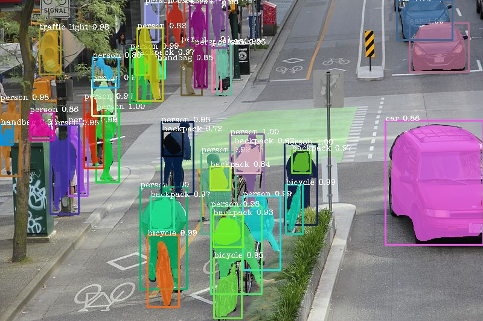

<h1 align="center"> <b>Objectify - Advanced Object Detection on Images</b></h1>

   

   

Object Detection, Semantic and Instance Segmentation - 

 

    
- Vehicles (Truck, Bus, Boat, Airplane)
- Roads Signage - (Zebra Crossing, Traffic Light)
- Man-Made Architectures - (Buildings, Bridges)

### **DataSets**
- `COCO` - The `MS COCO (Microsoft Common Objects in Context) `dataset is a `large-scale object detection` , `segmentation`, `key-point detection`, and `captioning dataset`. The dataset consists of 328K images.
- `CityScapes` - Cityscapes is a large-scale database which focuses on semantic understanding of urban street scenes. It provides `semantic`, `instance-wise`, and `dense pixel annotations` for 30 classes grouped into 8 categories (flat surfaces, humans, vehicles, constructions, objects, nature, sky, and void). Data was captured in 50 cities during several months, daytimes, and good weather conditions with over 25k images.

### **Objectives :**
1. Fully Working Web application : Allowing the user to Upload Image.
2. Perform `Instance Segmentation` plus `Object Detection` - Creating `Annotations` over the Uploaded Image with `Bounding Boxes` and `Class Names`, and `Pixel Labelling`.
3. Displaying the Output Image with the Annotated Object on it.

### Our Idea :
1. Our web app takes an input image from the user using `JavaScript`
2. The respective image gets saved in the locally hosted centralised  `SQL database`.
3. The model will fetch the object and will detect the same, using the libraries `tensorflow`, `pytorch` & `pixellib` with `Deep Learning Models` such as `PointRend` and `MobileNetV3`. 
4. The input image gets annotated using `cv2` libraries.
5. The `annotated` objects that has been detected, gets displayed along with the original uploaded image via the `Django Backend`.
6. The model gives results in the form of a `JSON (JavaScript Object Notation)` format and the output is displayed with `CSS` and `HTML` website on the local web server.

 

 

<!-- ### TechStack Used :
- Python
- JavaScript
- Django
- Tensorflow
- Pytorch -->

## **🛠 &nbsp;Tech Stack**

    
    
    
    
     
    
    
     <a href="https://opencv.org/" target="_blank"> ></a>

 

 

## **⚙️ &nbsp;What is Object Detection, Instance & Semantic Segmentation?**

`Object Detection` is a `computer vision` technique for locating instances of objects in images or videos. `Object detection `algorithms typically leverage `machine learning` or `deep learning` to produce meaningful results. When humans look at images or video, we can recognize and locate objects of interest within a matter of moments. The goal of `object detection` is to replicate this intelligence using a computer.

`Instance Segmentation` is identifying each object instance for every known object within an image. `Instance segmentation` assigns a label to each pixel of the image. It is used for tasks such as counting the number of objects in an image along with object localization.

 

 

## **⚙️ &nbsp;Object Detection using Pointrend Model**

 

 
 

For performing `segmentation` of the objects in images and videos, `PixelLib` library is used, and so we have invoked the same in our respective project. 
`PixelLib` provides support for `Pytorch` and it uses `PointRend` for performing more accurate and real time instance segmentation of objects in images and videos. Hence, annotations over the image takes place once the work is done.

 

 

## **⚙️ &nbsp;Instance Segmentation using MobileNetV3**

 

 

The implementation of the `MobileNetV3` architecture follows closely the original paper and it is customizable and offers different configurations for building `Classification`, `Object Detection` and `Semantic Segmentation` backbones. 
Furthermore, it was designed to follow a similar structure to `MobileNetV2` and the two share common building blocks. The `MobileNetV3` class is responsible for building a network out of the provided configuration. The models are then adapted and applied to the tasks of `object detection` and `semantic segmentation`. 
For the task of `semantic segmentation` (or any `dense pixel prediction`), we propose a new efficient segmentation decoder to achieve new state of the art results for `mobile classification`, `detection` and `segmentation`. Finally, the project tries to faithfully implement `MobileNetV3` for real-time `semantic segmentation`, with the aims of being efficient, easy to use, and extensible.

 

 

## **⚙️ &nbsp;Instance Segmentation vs. Object Detection**

 

 <b>Object Detection</b> 

 <b>Instance Segmentation</b> 

<b> ~By Shubham Singh and Soumyo Nath Tripathy</b>
